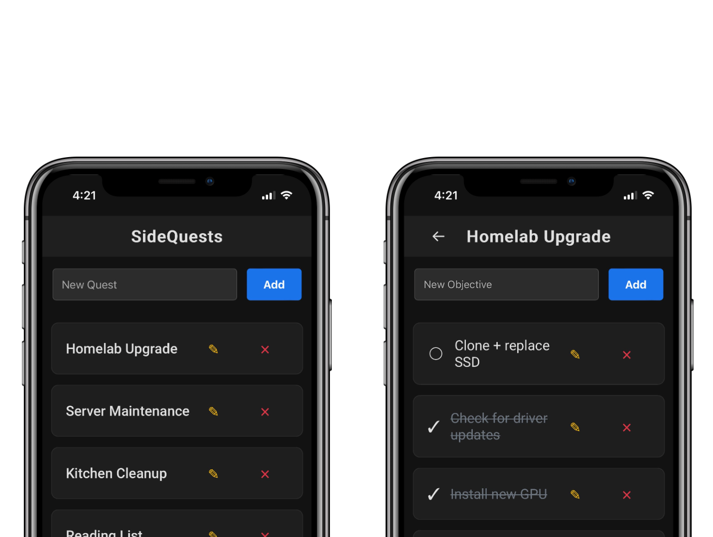

# SideQuests - Objective Tracker


SideQuests provides an intuitive and mobile friendly web-interface for managing tasks and objectives.

## 🐳 Setup

### Docker Run

```bash
docker run -d \
  -p 8080:8080 \
  -e PORT=8080 \
  -e ADMIN_USERNAME=your_admin_username \
  -e ADMIN_PASSWORD=your_admin_password \
  -e SECRET_KEY=your_secret_key \
  need4swede/sidequests:latest
```

### Docker Compose
```yml
services:
  SideQuests:
    image: need4swede/sidequests:latest
    container_name: SideQuests
    ports:
      - "8080:8080"
    volumes:
      - ./instance:/app/instance
    environment:
      - PORT=8080
      - ADMIN_USERNAME=your_admin_username
      - ADMIN_PASSWORD=your_admin_password
      - SECRET_KEY=your_secret_key

```

## ✨ Core Functionality

**Quests**
   - Quests contain individual Objectives. Leaving the title blank automatically assigns today's date as the title.

**Objectives**
   - Objectives are individual tasks within Quests. You need to complete every Objectives to finish a Quest.

## 🎨 UI Goodies

**Simple and Straightforward**
   - Nothing fancy here! Just enough to keep you on track and focused!

**Designed for Mobile**
   - Fully responsive pages and elements makes for a great PWA experience.

**Block Level Design**
   - Drag and drop elements to easily organize your Quests & Objectives.

**Dark Mode**
   - No brainer.

## 🛠️ Technical Stack

- 🐍 **Backend**: Flask (Python)
- 💾 **Database**: SQLAlchemy with SQLite
- 🌐 **Frontend**: HTML, CSS, JavaScript